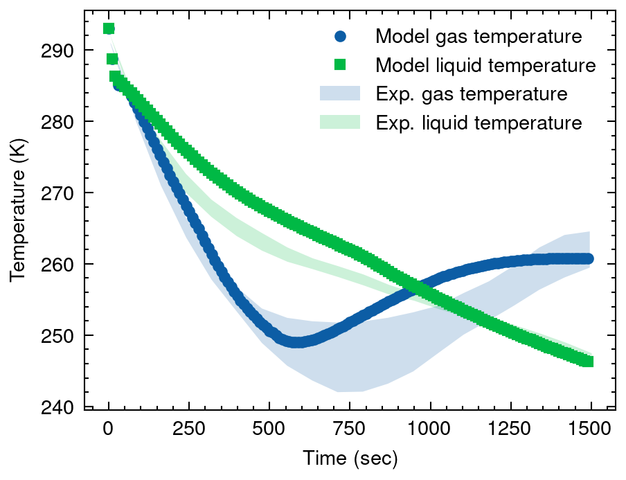

# ORS - openthermo
```
                          __  __                            
  ____  ____  ___  ____  / /_/ /_  ___  _________ ___  ____ 
 / __ \/ __ \/ _ \/ __ \/ __/ __ \/ _ \/ ___/ __ `__ \/ __ \
/ /_/ / /_/ /  __/ / / / /_/ / / /  __/ /  / / / / / / /_/ /
\____/ .___/\___/_/ /_/\__/_/ /_/\___/_/  /_/ /_/ /_/\____/ 
    /_/                                                     
```

Code for calculating depressurization / blowdown of pressure vessels accompanying a [paper](https://doi.org/10.26434/chemrxiv-2025-00xzc) submitted to [Process Safety Progress](https://aiche.onlinelibrary.wiley.com/journal/15475913). 

Download or clone the code and install from the the *openthermo* directory (no official pypi package yet)

```
pip install -e .
```

To reproduce results from the paper

```
cd tests
python test_blowdown.py
```

Uncomment the case in the main function to be analysed. 

## High-level description
The code considers a vessel filled with a fluid at time equals zero. Fluid is discharged through an orifice. As mass is discharged the pressure and temperature drops over time, where heat can be exchanged through the vessel wall with the surroundings. Since both mass and heat can be exchanged with the surroundings it constitutes an open thermodynamic system hence the name of the code: *openthermo*.


The code uses a multi-component real-gas equation of state (either Peng-Robinson or Soave-Redlich-Kwong) to describe the system. Two phases can be handled by the code, occuring at any time during the depressurisation process. 

## Full or partial equilibrium
*openthermo* can either assume full equilibrium between gas and liquid or partial equilibrium. In both cases the vessel material temperature may be different depending on contact with either gas or liquid (different heat transfer rates). In the partial equilibrium approach gas and liquid may also achieve different temperatures, 
The partial equilibrium approach is emulating the methodology of [VBsim](http://dx.doi.org/10.1016/j.ces.2015.01.019) by Terenzi *et al.* and is comparable to legacy codes BLOWDOWN from Imperial College and BLOWSIM from University College London. 
To the best of our knowledge this is the first ever rigorous blowdown simulation tool which can manage partial equilibrium available as *open source*. 

## Code foundation
This codes relies heavily on the [thermo](https://github.com/CalebBell/thermo) package by Caleb Bell, with the core flash calculation replaced by [thermopack](https://github.com/thermotools/thermopack) from SINTEF for increased stability and speed. *openthermo* builds partially on [HydDown](https://github.com/andr1976/HydDown) and has also been inspired by [HYRAM+](https://github.com/sandialabs/hyram) for the ODE integration part.  

The following packages are scaffolding *openthermo*:

- thermopack
- thermo
- fluids
- ht
- chemicals
- numpy
- scipy 
- matplotlib
- SciencePlots

## Validation 
The code has been validated against available experimental data from the literature (see paper). 

Wall temperature:


Fluid temperature:


