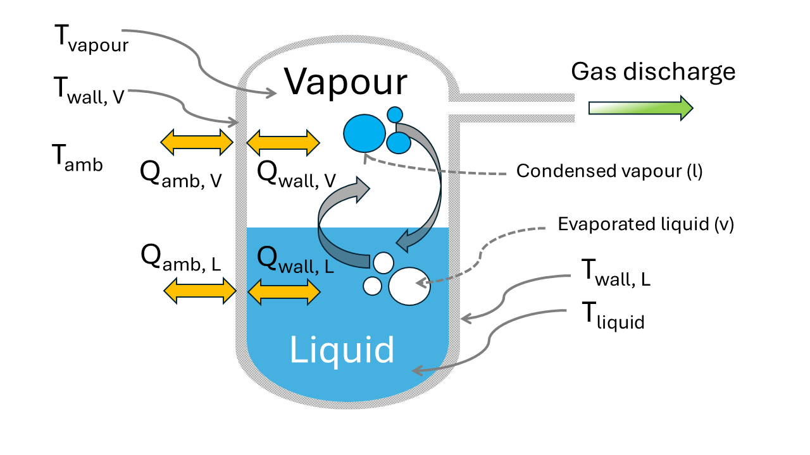

# Introduction
*openthermo* is an open source Python3 tool for calculation of vessel depressurization / blowdown. The main phenomena modelled are visualized in Figure [@Fig:logo].
The thermodynamic state inside the vessel changes over time as seen from immediately observable variables temperature (T) and pressure (P).
This is caused by change in fluid inventory (density) due to flow of gas and/or liquid out of the vessel.
Further, heat is transferred from or to the surroundings via convective heat transfer on the in- and outside of the vessel with heat being conducted through the vessel wall. Due to differences in thermal resistance the vessel wall will obtain a temperature different from the fluid. Depending on the assumptions regarding the description of the fluid inside the vessel, the gas and liquid may have the same temperature (equilibrium assumption) or the two-phases may have different temperature (partial equilibrium assumption).

{#fig:logo}

Running the code is as simple as:

    Python main.py input.yml

where `main.py` is the main script and `input.yml` is the input file in Yaml syntax.

## Citing openthremo
If you use *openthermo* please cite the following reference [@Andreasen2021]:

Andreasen, A., Stegelmann, C. (2025). Open source pressure vessel blowdown modelling under partial phase equilibrium. Process Safety Progress (In review), https://doi.org/10.21105/joss.03695

    @article{AndreasenStegelmann,
      #doi = {10.21105/joss.03695},
      #url = {https://doi.org/10.21105/joss.03695},
      year = {2025},
      publisher = {Wiley},
      #volume = {6},
      #number = {66},
      #pages = {3695},
      author = {Anders Andreasen and Carsten Stegelmann},
      title = {Open source pressure vessel blowdown modelling under partial phase equilibrium},
      journal = {Process Safety Progress}
    }

This manual can be cited as [@Andreasen2024]:

Anders Andreasen. HydDown - User guide and technical reference. 2024. ⟨hal-04858235⟩

    @report{Andreasen2024,
      url = {https://hal.science/hal-04858235},
      year = {2024},
      publisher = {HAL open science},
      author = {Anders Andreasen},
      title = {HydDown -- user guide and technical reference},
    }

## Background
### Early works
The foundation of *openthermo* was laid by Carsten Stegelmann, more than a decade ago, who developed code for running blowdown calculations in a spreadsheet relying heavily on VBA and a legacy flash calculation routine (DLL) coded in FORTRAN by late Prof. Michael Michelsen. This worked surprisingly well and executed very efficiently. The short-comings where lacking heat transfer modelling as well as an *equilibrium* only approach i.e. two-phase fluids were in full equilibrium at all times. 

### Challenges
The VBA code provided tricky to maintain in a version control system, and in the meantime the availability of high-quality thermodynamic packages for Python increased significantly. However, reimplementing an entire codebase is a time-consuming task, and this proved difficult to manage working full time as engineering consultants, and years went by without being able to fully to the long haul required. 

### Proof of concept
Having worked together in the same company, Carsten and I split ways 5 years ago. Then the Covid-19 hit and that freed up some spare time for me, staying at home without a lot of activities being possible and that lead to the development of HydDown. It started as a small spare-time project for calculation of vessel filling and depressurization behaviour. At that time the expectation was that a lot of engineering work was expected in high-pressure storage and filling stations. The work on HydDown served as a proof of concept for an efficient implementation in Python mainly provided by the [Coolprop](http://www.coolprop.org/) back-end [@doi:10.1021/ie4033999]. Eventually HydDown matured and is now in a state where it can model heat transfer in both steel and dual-layer low thermal conductivity composites during depressurisation/pressurisation. However, it cannot manage two-phase (gas/liquid) behaviour due to limitations in the flash calculation. Thus, a change in thermodynamic back-end was inevitable.

### *openthermo* development
Recently, I joined ORS Consulting with Carsten, and we revived our plans for a rigorous blowdown simulation tool. The remaining challenge was the more complex two-phase (or three-phase) flash problem and the non-equilibrium / partial equilibrium assumption. 
At all times the big inspiration has been the work done at Empirical College London, University College London and later on also Università Politecnica delle Marche on the codes BLOWDOWN, BLOWSIM and VBsim, respectively. The former was also acquired by AspenTech and made available in HYSYS. Further the motivation has also been to have a tool easily accessible as a supplement to commerical (and expensive) tools. Both to reduce load on license pools, but also to provide more efficient workflows. We wanted to make the tool open source and available to the public, but license limitations on the legacy flash calculation by Prof. Michelsen required an alternative flash calculation. Several tools are now available such as Python *thermo*, NeqSim and *thermopack*. Handling vessel depressurisation, which is effectively an UV-flash problem (Internal Energy - Volume) requires extremely many flash calculations to be performed. Thus, a fast and stable flash calculation is required. In order to provide speed and stability the preliminary choice has been *thermopack* from SINTEF, although it may change in the future in order to provide a three-phase (VLLE) flash.   

## Limitations and implementation details 
A few choices has been made to keep things simple:

- [thermopack](http://www.coolprop.org/) is used as thermodynamic backend
- Thermodynamic and transport properties (enthalpy, entropy, internal energy, liquid density, thermal conductivity, viscosity) is provided via Python *thermo* / *chemicals*.
- No temperature stratification inside bulk phases
- No temperature gradient through vessel wall. 
- Heat transfer is modelled as constant or simplified using empirical correlations
- Only single and two-phase (VLE) is handled. Three-phase (VLLE) cannot currently be modelled in the open source version.
- Currently only the Peng-Robinson (PR) and Soave-Redlich-Kwong cubic equations of state are made available.  
- *openthermo* and it's legacy code is built by engineers NOT software developers.  

Ignoring temperature gradients in the vessel wall is an acceptable assumption for (not too thick) steel vessel walls. However, low thermal conductivity materials cannot accurately be modelled. In order to do so a 1-D heat transfer model shall be implemented. 

One limitation of *thermopack* is that including pseudo components is not easy if the internal property calculations shall be used. Further, *thermopack* does not provide transport properties. In order to allow an implementation for pseudo components and transport properties the *thermopack* library is only used for flash calculations and used as a plugin, the rest (and less computationally demanding tasks) is provided by Python *thermo*. 

While *openthermo* has been extensively validated and fidelity has been built, we have not had the work force or man-months/years available like the legacy university projects or the commerical software providers. This means that there likely will be situations where the code fails to provide results, cases that are not covered or simply the code will not work. This is the cost and risk of using open source software.   

## Getting the software
The source code can be obtained either from GitHub (via `git` or via the latest tar-ball release) or via **pip** . No packaged releases have currently been planned for **conda**.  

The main branch is located here:

[`https://github.com/andr1976/HydDown`](https://github.com/andr1976/HydDown)

Clone the repo by:

    git clone https://github.com/andr1976/HydDown.git

Running from source via `git` the dependencies must be installed manually from the repo root dir:

    pip install -r requirements.txt

Installation of latest release via **pip** also installe dependecies automatically:

    pip install hyddown

In case `pip` links to a v2.7 of Python you will get an error. If so try the following:

    Python3 -m pip install hyddown

where Python3 is the symlink or full path to the Python3 executable installed on your system.

## Requirements

- [Python](http://www.Python.org) 
- [Numpy](https://numpy.org/)
- [matplotlib](https://matplotlib.org/)
- [Coolprop (6.4.1)](http://www.coolprop.org/)
- [cerberus](https://docs.Python-cerberus.org/en/latest/)
- [PyYaml](https://pypi.org/project/PyYAML/)
- [pandas](https://pandas.pydata.org/)
- [Scipy](https://www.scipy.org/)
- [tqdm](https://tqdm.github.io/)

The script is running on Windows 10/11 x64, with stock Python installation from Python.org and packages installed using pip.
It should also run on Linux (it does on an Ubuntu image on GitHub) or in any conda environment as well, but this hasn't been checked.

## Testing
Although testing is mainly intended for automated testing (CI) during development using github actions, testing of the installed package can be done for source install by:

    python -m pytest

run from the root folder. In writing 33+ test should pass.

For the package installed with pip navigate to the install directory `../site-packages/openthermo` and run:

    python -m pytest

## Units of measure
The SI unit system is adapted for this project.
The following common units are used in the present project and this also applies to the units used in the input files:

Property | Unit | Comment
----    | ----  | ----
Temperature | K | $^\circ$ C may be used in plots
Pressure | Pa    | bar is used in plots
Mass | kg |
Volume | m$^3$ |
Time | s |
Energy | J |
Duty/power | W
Length | m
Area | m$^2$
Heat flux | W/m$^2$
Heat transfer coefficient | W/(m$^2$ K)
Thermal conductivity | W/(m K)
Density | kg/m$^3$
Heat capacity | J/(kg K)

: Unit system {#tbl:units}

As will be noted when presenting the equations implemented in the code, some of the equations utilise different units than the ones listed in [@tbl:units].
However, it is important to note that unit conversions are built in to the methods implemented, so the user shall not worry about unit conversion.  

## Credit
In the making of this document a great deal of material has been sourced (and modified) from a former colleague's M.Sc. thesis [@iskov], from co-published papers [@Bjerre2017][@safety4010011] and from on-line material published under permissive licenses (with proper citation). 

Further, the making of this project would not have possible without the awesome [CoolProp](http://www.coolprop.org/) library [@doi:10.1021/ie4033999].
I am also thankful for enlightening discussions with former colleague Jacob Gram Iskov Eriksen (Ramboll Energy, Denmark)  and former and now present colleague Carsten Stegelmann (ORS Consulting).

The present document is typeset using Markdown + [pandoc](https://pandoc.org/) with the [Eisvogel](https://github.com/Wandmalfarbe/pandoc-latex-template) template.

## License

MIT License

Copyright (c) 2021-2025 Anders Andreasen

Permission is hereby granted, free of charge, to any person obtaining a copy
of this software and associated documentation files (the "Software"), to deal
in the Software without restriction, including without limitation the rights
to use, copy, modify, merge, publish, distribute, sublicense, and/or sell
copies of the Software, and to permit persons to whom the Software is
furnished to do so, subject to the following conditions:

The above copyright notice and this permission notice shall be included in all
copies or substantial portions of the Software.

THE SOFTWARE IS PROVIDED "AS IS", WITHOUT WARRANTY OF ANY KIND, EXPRESS OR
IMPLIED, INCLUDING BUT NOT LIMITED TO THE WARRANTIES OF MERCHANTABILITY,
FITNESS FOR A PARTICULAR PURPOSE AND NONINFRINGEMENT. IN NO EVENT SHALL THE
AUTHORS OR COPYRIGHT HOLDERS BE LIABLE FOR ANY CLAIM, DAMAGES OR OTHER
LIABILITY, WHETHER IN AN ACTION OF CONTRACT, TORT OR OTHERWISE, ARISING FROM,
OUT OF OR IN CONNECTION WITH THE SOFTWARE OR THE USE OR OTHER DEALINGS IN THE
SOFTWARE.

# Usage
## Basic usage
From the source repository, running the code is as simple as:

    Python src/main.py input.yml

where main.py is the main script and input.yml is the input file in Yaml syntax.

The Yaml input file is edited to reflect the system of interest.

Further, a usable copy of a main script is installed in the Python installation Scripts/ folder:

    /Python3x/Scripts/hyddown_main.py

or from GitHub/in the source folder:

    HydDown/Scripts/hyddown_main.py

Various example files are included for inspiration under site-packages:

    /site-packages/hyddown/examples/

or in the git/source directory tree

    HydDown/src/hyddown/examples/

## Demos
A few demonstrations of the codes capability are available as [`streamlit`](https://streamlit.io/) apps:

- Vessel gas pressurisation/depressurization for various gases at [`https://share.streamlit.io/andr1976/hyddown/main/scripts/streamlit_app.py`](https://share.streamlit.io/andr1976/hyddown/main/scripts/streamlit_app.py)
- Response to external fire of vessel equipped with a PSV using the Stefan-Boltzmann fire equation at[`https://share.streamlit.io/andr1976/hyddown/main/scripts/streamlit_sbapp.py`](https://share.streamlit.io/andr1976/hyddown/main/scripts/streamlit_sbapp.py)
- Vessel depressurization including slow opening of valve at [`https://share.streamlit.io/andr1976/hyddown/main/scripts/streamlit_cvapp.py`](https://share.streamlit.io/andr1976/hyddown/main/scripts/streamlit_cvapp.py)

The various streamlit apps are also included in the scripts folder for running the scripts on a local machine.

## Calculation methods
The following methods are implemented:

- Isothermal: constant temperature of the fluid during depressurization (for a very slow process with a large heat reservoir)
- Isenthalpic: constant enthalpy of the fluid, no heat transfer with surroundings, no work performed by the expanding fluid for depressurization, no work added from inlet stream
- Isentropic: constant entropy of the fluid, no heat transfer with surroundings, PV work performed by the expanding fluid
- Isenergetic: constant internal energy of the fluid
- Energy balance: this is the most general case and is based on the first law of thermodynamics applied to a flow process.

For `isothermal`/`isenthalpic`/`isentropic`/`isenergetic` calculations the minimal input required are:

- Initial conditions (pressure, temperature)
- vessel dimensions (ID, length)
- valve parameters (Cd, diameter, backpressure)
- Calculation setup (time step, end time)
- Type of gas

If heat transfer is to be considered the calculation type `energybalance` is required. A few options are possible:

- Fixed U: U-value, i.e. overall heat transfer coefficient, is required and ambient temperature required.
Based on the ambient (external) temperature, the fluid temperature, and the U-value, the heat flux Q is calculated for each time step.
In this calculation method the temperature of the vessel wall is not calculated:

$$ Q = UA(T_{ambient} - T_{fluid})  $$

- Fixed Q: The external heat flux, Q, applied to the fluid is specified and constant.
The ambient temperature is not required.
Further, the vessel wall temperature is redundant and not calculated.
- Specified h: The external heat transfer coefficient must be specified and either the internal heat transfer coefficient is provided or calculated from the assumption of natural convection from a vertical cylinder at high Gr number.
Ambient temperature is required. Using this method the wall temperature is calculated from an energy balance over the vessel wall taking in and out flux to/from the external ambient plenum as well as heat flux to/from the fluid inventory into account.
- Fire: The Stefan-Boltzmann equation is applied for estimating the external heat duty.
The fire heat flux depends on the vessel wall temperature, and the wall temperature is continuously updated as in the method with specified h.

More elaborate description of the required input for the different calculation types are provided in [@Sec:input].

## Script
HydDown comes with a script which can be used as a command-line tool to start calculations.
If an input filename (path) is given as the first argument, this input file will be used.
If no arguments are passed, the script will look for an input file with the name `input.yml`.
The content of the main script is shown below:

~~~ {.Python}
import yaml
import sys
from hyddown import HydDown

if __name__ == "__main__":
    if len(sys.argv) > 1:
        input_filename = sys.argv[1]
    else:
        input_filename = "input.yml"

    with open(input_filename) as infile:
        input = yaml.load(infile, Loader=yaml.FullLoader)

    hdown=HydDown(input)
    hdown.run()
    hdown.verbose=1
    hdown.plot()
~~~

## Module import
To use HydDown simple import the main calculation class `HydDown`.

~~~ {.Python}
from hyddown import HydDown
~~~

## Input file examples
When using HydDown a dictionary holding all relevant input in order for HydDown to do vessel calculations shall be provided when the class is initialized. One way is to read an input file. For HydDown a Yaml format is chosen, but if JSON is a preference this should also work with the Yaml parser being substituted with a JSON parser.

An example of a minimal file for an isentropic vessel depressurization (no heat transfer) is shown below

~~~ {.Yaml}
vessel:
  length: 1.524
  diameter: 0.273
initial:
  temperature: 388.0
  pressure: 15000000.
  fluid: "N2"
calculation:
  type: "isentropic"
  time_step: 0.05
  end_time: 100.
valve:
  flow: "discharge"
  type: "orifice"
  diameter: 0.00635
  discharge_coef: 0.8
  back_pressure: 101300.
~~~

A more elaborate example which includes heat transfer and with validation data (some data points dropped for simplicity) included:

~~~ {.Yaml}
vessel:
  length: 1.524
  diameter: 0.273
  thickness: 0.025
  heat_capacity: 500
  density: 7800.
  orientation: "vertical"
initial:
  temperature: 288.0
  pressure: 15000000.
  fluid: "N2"
calculation:
  type: "energybalance"
  time_step: 0.05
  end_time: 100.
valve:
  flow: "discharge"
  type: "orifice"
  diameter: 0.00635
  discharge_coef: 0.8
  back_pressure: 101300.
heat_transfer:
  type: "specified_h"
  temp_ambient: 288.
  h_outer: 5
  h_inner: 'calc'
validation:
  temperature:
    gas_high:
      time: [0.050285, ... , 99.994]
      temp: [288.93, ... ,241.29]
    gas_low:
      time: [0.32393, ..., 100.11]
      temp: [288.67, ... ,215.28]
    wall_low:
      time: [0.32276, ... , 100.08]
      temp: [288.93, ... ,281.72]
    wall_high:
      time: [0.049115, ... ,100.06]
      temp: [289.18, ... ,286.09]
  pressure:
    time: [0.28869, ... , 98.367]
    pres: [150.02, ... ,1.7204]
~~~

## Input fields and hierarchy {#sec:input}
In the following the full hierarchy of input for the different calculation types is summarised.

At the top level the following fields are accepted, with the last being optional and the second last dependant on calculation type:

~~~ {.Yaml}
initial: mandatory
vessel: mandatory
calculation: mandatory
valve: mandatory
heat_transfer: depends on calculation type
validation: optional
~~~

### Calculation

The subfields under `calculation`, with value formats and options are:

~~~ {.Yaml}
calculation:
  type: "isothermal", "isentropic", "isenthalpic", "constantU", "energybalance"
  time_step: number
  end_time: number
~~~

The simulation end time is specified as well as the fixed time step used in the integration of the differential equations to be solved.
The four main calculation types are shown as well.

### Vessel

~~~ {.Yaml}
vessel:
  length: number, mandatory
  diameter: number, mandatory
  thickness: number, required when heat transfer is calculated
  heat_capacity: number, required when heat transfer is calculated
  density: number, required when heat transfer is calculated
  thermal_conductivity: number, required for 1-D transient heat transfer
  liner_thickness: number, required only for bi-material 1-D transient heat transfer
  liner_heat_capacity: number, required only for bi-material 1-D transient heat transfer 
  liner_density: number, required only for bi-material 1-D transient heat transfer
  liner_thermal_conductivity: number, required only for bi-material 1-D transient heat transfer  
  orientation: string, required when heat transfer is calculated
~~~

### Initial
~~~ {.Yaml}
initial:
  temperature: number, mandatory
  pressure: number, mandatory
  fluid: string, mandatory , e.g. "N2", "H2"
~~~

### Valve
The `valve` field determines the mode of the process is it for depressurization/discharge from the vessel using the value `discharge` or if mass flow is entering the vessel, filling it up/increasing pressure with the value `filling`.

Different types of mass flow devices can be specified:

- Restriction `orifice`
- Relief valve/pressure safety valve (only for `discharge` not `filling`)
- Control valve (`controlvalve`)
- A specified mass flow (`mdot`)

For the physical devices a `back_pressure` is required for the flow calculations.
The value of the `back_pressure` **is also used to specify the reservoir pressure when the vessel is filled**.
See also [@Sec:flow] for details about the calculation of flow rates.

~~~ {.Yaml}
valve:
  flow: string, mandatory "discharge" or "filling"
  type: string, mandatory "orifice", "controlvalve", "psv", "mdot"
  back_pressure: number, required for type "orifice", "controlvalve" and "psv"
  diameter: number, required for "orifice" and "psv"
  discharge_coef: number, required for "orifice" and "psv"
  Cv: number, required for "control_valve"
  characteristic:  string, optional for "control_valve"
  time_constant: number, optional for "control_valve"
~~~

For the calculations using a control valve as mass transfer device a linear rate for the actuator can be specified using the `time_constant` field. An associated valve characteristic is associated in order to translate the linear actuator rate to an opening Cv (of max. Cv). Three caracteristics can be specified:

- Linear
- Equal percentage (exponential)
- Quick opening/fast (square root)

### Heat transfer
For more information about the actual estimation of heat transfer see also [@Sec:heat]. For the case of `fire` heat input predetermined parameters for the Stefan-Boltzmann fire equation are used to calculate different background heat loads cf. [@Tbl:fire]

| Source          |  Fire type      |       Heat load ($kW/m^2$) |
|-----------------|-----------------|----------------------------|
| API521          | Pool            |                   60       |
| API521          | Jet             |                  100       |
| Scandpower      | Pool            |                  100       |
| Scandpower      | Jet             |                  100       |

: Fire heat loads {#tbl:fire}

~~~ {.Yaml}
heat_transfer:
  type: string, mandatory, "specified_h", "specified_Q", "specified_U", "s-b"
  temp_ambient: number, required for type "specified_h", "specified_U"
  h_outer: number, required for type "specified_h"
  h_inner: number or 'calc', required for type "specified_h"
  U_fix: number, required for type "specified_U"
  Q_fix: number, required for type "specified_Q"
  fire: string, required for type "s-b", 'api_pool','api_jet','scandpower_pool','scandpower_jet'
  D_thoat: number, required for flow type "filling", set to vessel ID as a starting point
~~~

### Validation
In order to plot measured data against simulated data the field `validation` is included.

The following arrays (one or more) are supported in the sub-field `temperature`:

- `gas_high`: highest measured values of the bulk gas
- `gas_low`: lowest measured values of the bulk gas
- `gas_mean`: average measured values of the bulk gas
- `wall_mean`: average measured values of the vessel (inner) wall
- `wall_high`  i.e. highest measured values of the vessel (inner) wall
- `wall_low`  i.e. lowest measured values of the vessel (inner) wall
- `wall_outer`  i.e. external measured values of the vessel (outer) wall
- `wall_inner`  i.e. internal measured values of the vessel (inner) wall

For each of the above fields arrays for `time`and `temp`shall be supplied with matching length.

A field for measured vessel pressure is also possible, where `time`and `pres` shall be identical length arrays. See also example below.

~~~ {.Yaml}
validation:
  temperature:
    gas_high:
      time: [0.050285, ... , 99.994]
      temp: [288.93, ... ,241.29]
    gas_low:
      time: [0.32393, ..., 100.11]
      temp: [288.67, ... ,215.28]
    wall_low:
      time: [0.32276, ... , 100.08]
      temp: [288.93, ... ,281.72]
    wall_high:
      time: [0.049115, ... ,100.06]
      temp: [289.18, ... ,286.09]
  pressure:
    time: [0.28869, ... , 98.367]
    pres: [150.02, ... ,1.7204]
~~~

# Theory
In this chapter the basic theory and governing equations for the model implementation in HydDown is presented.
The following main topics are covered:

- thermodynamics
- mass transfer
- heat transfer

## Thermodynamics

### Equation of state

### First law for flow process {#sec:firstlaw}
The control volume sketched in [@Fig:firstlaw], separated from the surrounding by a control surface, is used as a basis for the analysis of an open thermodynamic system with flowing streams (fs) in and out, according to [@sva]

A general mass balance or continuity equation can be written:

![Control volume with one entrance and one exit. The image has been sourced from [@firstlaw].](img/First_law_open_system.png){#fig:firstlaw}

$$ \frac{m_{cv}}{dt} + \Delta \left( \dot{m} \right)_{fs}= 0 $$ {#eq:continuity}

The first term is the accumulation term i.e. the rate of change of the mass inside the control volume, $m_cv$, and the $\Delta$ in the second term represents the difference between the outflow and the inflow

$$ \Delta \left( \dot{m} \right) _{fs} = \dot{m}_2 - \dot{m}_1 $$

An energy balance for the control volume, with the first law of thermodynamics applied, needs to account for all the energy modes with can cross the control surface. Each stream has a total energy

$$ U + \frac{1}{2}u^2 + zg $$

where the first term is the specific internal energy, the second term is the kinetic energy and the last term is the potential energy.
The rate at which each stream transports energy in or out of the control volume is given by

$$ \dot{m} (U + \frac{1}{2}u^2 + zg) $$

and in total

$$  \Delta \left[ \dot{m} (U + \frac{1}{2}u^2 + zg) \right]_{fs}$$

Furthermore, work (not to be confused with shaft work) is also associated with each stream in order to move the stream into or out from the control volume (one can think of a hypothetical piston pushing the fluid at constant pressure), and the work is equal to $PV$ on the basis of the specific fluid volume.
The work rate for each stream is

$$ \dot{m}(PV) $$

and in total

$$ \Delta\left[ \dot{m}(PV) \right]_{fs} $$

Further, heat may be transferred to (or from) the control volume at a rate $\dot{Q}$ and shaft work may be applied, $\dot{W}_{shaft}$.
Combining all this with the accumulation term given by the change in total internal energy the following general energy balance can be written:

$$ \frac{d(mU)_{cv}}{dt} + \Delta \left[ \dot{m} (U + \frac{1}{2}u^2 + zg) \right]_{fs} + \Delta \left[ \dot{m}(PV) \right]_{fs} = \dot{Q} +\dot{W}_{shaft}   $$

Applying the relation $H = U + PV$, setting $\dot{W}_{shaft} = 0$ since no shaft work is applied to or extracted from the vessel, and assuming that kinetic and potential energy changes can be omitted the energy balance simplifies to:

$$ \frac{d(mU)_{cv}}{dt} + \Delta \left[ \dot{m} H \right]_{fs} = \dot{Q}  $$

The equation can be further simplified if only a single port acting as either inlet or outlet is present:

$$ \frac{d(mU)_{cv}}{dt} + \dot{m} H  = \dot{Q}  $$ {#eq:energybalance}

where the sign of $\dot{m}$ determines if the control volume is either emptied or filled.
The continuity equation [@Eq:continuity] and the energy balance [@Eq:energybalance] combined with the equation of state are the key equations that shall be solved/integrated in order to calculate the change in temperature and pressure as a function of time.

## Flow devices {#sec:flow}
### Restriction Orifice
When a fluid flows through a restriction or opening such as an orifice, the velocity will be affected by conditions upstream and downstream.
If the upstream pressure is high enough, relative to the downstream pressure, the velocity will reach the speed of sound (Ma = 1) and the flow rate obtained will be the critical flow rate.
This condition is referred to as choked flow.
The maximum downstream pressure for the flow to still be sonic (Ma = 1), is when $P_d = P_c$.
The ratio of the critical and upstream pressure is defined by equation [@Eq:P_critical].

$$ \frac{P_{c}}{P_u}=\left (\frac{2}{k+1} \right)^\frac{k}{k-1} $$ {#eq:P_critical}

- $P_c$ is the critical pressure. [kPa]
- $P_d$ is the downstream pressure. [kPa]
- $P_u$ is the upstream pressure. [kPa]
- k is the isentropic coefficient, approximated by the ideal gas heat capacity ratio $C_p/C_v$. [-]

In order to calculate the mass flow rate through an orifice equations are used based on literature from the Committee for the Prevention of Disasters [@yellowbook].

To account for the difference in choked and non-choked flow a set limit pressure is introduced as in equation [@Eq:plimit].
If the downstream pressure, $P_{down}$, is below the pressure limit, $ P_{limit}$, then the flow is choked, and the pressure used, $P_{used}$, in equation [@Eq:massfloworifice] should be the pressure limit, $P_{limit}$.
Otherwise if the downstream pressure, $P_{down}$, is greater than or equal to the pressure limit, $P_{limit}$, the flow is no longer choked and the pressure used should be the downstream pressure, $P_{down}$ [@yellowbook].

$$ P_{limit}=P_{up} \cdot \left ( \frac{2}{k+1} \right ) ^{\frac{k}{k-1}} $$ {#eq:plimit}

$$ \dot{m}_{flow}= C_d  \cdot A \cdot\sqrt{\left ( \frac{2 k}{k-1}\right )  \cdot  P_{up} \cdot \rho \cdot \left (  \frac{P_{used}}{P_{up}} \right )^{\frac{2}{k}} \left (1-\left ( \frac{P_{used}}{P_{up}} \right ) ^{\frac{k-1}{k}} \right )} $$ {#eq:massfloworifice}

- $\rho$ is the density of the gas upstream. $[kg/m^3]$
- $P_{limit}$ is the pressure limit of the upstream absolute pressure. $[bara]$
- $P_{up}$ is the absolute pressure upstream of the orifice. $[bara]$
- $k$ is the ratio of the heat capacities at constant pressure, $C_p$, and at constant volume, $C_v$.
- $P_{down}$ is the absolute pressure downstream of the orifice. $[bara]$
- $P_{used}$ is the pressure used in the mass flow equation based on choked or non-choked conditions. $[bara]$
- $\dot{m}_{flow}$ is the mass flow through the orifice. $[kg/s]$
- $C_d$ is the discharge coefficient of the orifice opening. $[-]$
- $A$ is the cross sectional area of the orifice. $[m^2]$

## Heat transfer {#sec:heat}

### Natural convection
Experiments have indicated that the internal heat transfer mechanism for a vessel subject to depressurization can be well approximated by that of natural convection as found from measured Nusselt numbers being well correlated with Rayleigh number, with no apparent improvement in model performance by inclusion of the Reynolds number in the model [@woodfield].

To determine the heat transfer for the gas-wall interface, the following is applied cf. equation [@Eq:newton]:

$$\frac{dQ}{dt} = \dot{Q} = h A ( T_{s} - T_{gas} ) $$  {#eq:newton}

- $d Q$ is the change in thermal energy due to convective heat transfer. [J]
- $d t$ is the change in time during the heat transfer. [s]
- $h$ is the convective heat transfer. [W/m$$^2$$K ]
- $A$ is the area normal to the direction of the heat transfer. [m$^2$]
- $T_{s}$ is the inner surface temperature of the geometry. [K]
- $T_{gas}$ is the temperature of the bulk gas inside the vessel. [K]

The convective heat transfer will need to be estimated for the the gas-wall interface, by the use of empirical relations for the Nusselt number.
The Nusselt number describes the ratio of convective heat transfer to conductive heat transfer, normal to a surface area, as given in equation [@eq:Nu].

$$ Nu=\frac{hL}{k} $$ {#eq:Nu}

- $Nu$ is the Nusselt number. [-]
- $h$ is the convective heat transfer. [W/m$^2$K]
- $L$ is a characteristic length of the geometry. [m]
- $k$ is the thermal conductivity of the gas. [W/m$\cdot$K]

The characteristic length $L$ used is the height of the gas volume i.e. the length of a vertical vessel or the diameter of a horizontal vessel.

The empirical correlations used to calculate the Nusselt number of the gas-wall interface is a function of the Rayleigh number, which can be defined by the Grashof number and Prandtl number, as in equation [@Eq:rayleigh_gas]:

$$ Ra=Gr \cdot Pr $$ {#eq:rayleigh_gas}

- $Ra$ is the Rayleigh number. [-]
- $Gr$ is the Grashof  number. [-]
- $Pr$ is the Prandtl number. [-]

The Grashof number is a dimensionless number which approximates the ratio of the buoyancy forces to viscous forces, as given in equation [@Eq:grashof_gas}:

$$ Gr=\frac{\beta g\rho^2 L^3 \Delta T }{\mu^2} $$ {#eq:grashof_gas}

The Prandtl number is a dimensionless number defined as the ratio of the momentum diffusivity to thermal diffusivity, as given in equation [@Eq:prandtl_gas]:

$$ Pr=\frac{c_p \mu}{k} $$ {#eq:prandtl_gas}

- $\beta$ is the coefficient of volume expansion. [1/K]
- $g$ is the standard acceleration of gravity. [m/s$^2$]
- $\rho$ is the gas density. [kg/m$^3$]
- $L$ is the characteristic length. [m]
- $\Delta T$ is the temperature difference of the surface and gas. [K]
- $\mu$ is the dynamic viscosity. [kg/m$\cdot$s]
- $c_p$ is the heat capacity of gas. [J/kg$\cdot$K]
- $k$ is the thermal conductivity of gas. [J/m$\cdot$K]

It is important to note that the properties in the above equations shall be evaluated at the fluid film temperature which can be approximated by the average of the the fluid bulk temperature and the vessel wall temperature [@geankoplis].

The mechanism of heat transfer on the outside of the vessel at ambient conditions is similar to the above.
In HydDown the external heat transfer is not modelled currently.
A heat transfer coefficient shall be provided.

### Conduction
For accurate prediction of the outer and especially the inner wall temperature for correct estimation of internal convective heat transfer and the average material temperature, the general equation of 1-D unsteady heat transfer shall be solved:

$$ \frac{\delta T}{\delta t} = \frac{k}{\rho c_p} \frac{\delta^2 T}{\delta x^2} $$

- T is temperature
- x is the spatial (1-D) coordinate
- k is the thermal conductivity
- $\rho$ is the material density
- $C_p$ is the specific heat capacity

To be solved, the initial values and boundary values must be specified.
In its default state (if thermal cobductivity is not applied for the vessel), HydDown does not include the unsteady heat transfer model, i.e. the assumption is that the temperature from outer to inner surface is uniform and equal to the average temperature.
This is obviously a crude approximation, but might be justified depending in the Biot number:

$$ Bi = \frac{hL}{k} $$

The Biot number is a simple measure of the ratio of the heat transfer resistances at the surface of a body to the inside of a body.
The ratio gives an indication to which extent the temperature will vary in space (gradient) when the body is subject to a displacement in temperature at the surface boundary layer.
Striednig *et al.* [@STRIEDNIG] concluded that for a type I (steel) cylinder the Biot number was approx. 0.03 and hence the error in assuming a uniform temperature in the vessel wall was low.

With a typical thermal conductivity of 45 $W/m K$ for steel and a heat transfer coefficient up to 600 $W/m^2 K$ [@woodfield] the Biot number for a vessel with a wall thickness of 2 cm is 0.27.
This is significantly higher than that approximated by [@STRIEDNIG].
However, the Biot number is significantly lower than 1, and the assumption of a uniform temperature is reasonable.
However, for increased wall thickness, and/or for different materials with lower thermal conductivity, the error may grow to an unacceptable level.

Especially for vessels with low conductivity materials (or very thick walls) accurate estimation of the vessel wall temperatures requires the 1-D transient heat transfer problem to be solved. 

### Fire heat loads
The heat transfer from the flame to the shell is modelled using the recommended approach from Scandpower [@scandpower] and API [@API521].
The heat transfer from the flame to the vessel shell is divided into radiation, convection, and reradiation as seen in equation [@Eq:flame]:

$$ q_f=\underbrace{{\alpha}_s \cdot {\varepsilon}_f \cdot \sigma \cdot T_f^4}_\text{Radiation}+\underbrace{h_f \cdot (T_f-T_s(t))}_\text{Convection}-\underbrace{{\varepsilon}_s \cdot \sigma \cdot T_s(t)^4 }_\text{Reradiation} $$ {#eq:flame}

- $q_f$ is the flame heat flux. [W/m$^2$]
- ${\alpha}_s$ is the vessel surface absorptivity. [-]
- ${\varepsilon}_f$ is the flame emissivity. [-]
- $\sigma$ is the Stefan-Boltzmann constant, $\sigma$ = $5.67 \cdot 10 ^ {-8}$  [W/m$^2 \cdot$ K$^4$]
- $T_f$ is the flame temperature. [K]
- $h_f$ is the convection heat transfer coefficient between the flame and the surface. [W/m$^2 \cdot$ K]
- $T_s(t)$ is the time dependent surface temperature. [K]
- ${\varepsilon}_s$ is the surface emissivity. [-]

This model assumes that the pressure vessel is fully engulfed by the flame.
This means that the view factor for the radiation is unity and is therefore not taken into consideration.
The convective heat transfer coefficients for a jet fire and a pool fire, and recommended values for the emissivity and absorptivity, are given by Scandpower as [@scandpower]:

- $h_{jet~fire}$ = 100 [W/m$^2 \cdot$K]
- $h_{pool~fire}$ = 30 [W/m$^2 \cdot$K]
- ${\alpha}_s$ = 0.85
- ${\varepsilon}_s$ = 0.85
- ${\varepsilon}_f$ = 1.0 (optical thick flames, thickness > 1 m)

The flame temperature is found by solving equation [@Eq:flame2] for the incident heat flux in relation to the ambient conditions.
The flame temperature is kept constant throughout the simulation:

$$ q_{total}=\sigma \cdot T_f^4 + h_f \cdot (T_f-T_{amb})$$ {#eq:flame2}

- $q_{total}$ is the incident flame heat flux as given in table [@Tbl:heatfluxes1]. [W/m$^2$]
- $T_{amb}$ is the ambient temperature $\approx$ 293 K (20$^\circ$ C)

The heat flux used to calculate the flame temperature is given in table [@tbl:heatfluxes1].

|                        | Small jet fire  [kW/m$^2$]  |  Large jet fire  [kW/m$^2$] |  Pool fire  [kW/m$^2$]
| ----                   |  ----           |  ----           | ----
| Peak heat load         |  250            |  350            | 150         
| Background heat load   |   0             |   100           |  100         

: Incident heat fluxes for various fire scenarios given by Scandpower [@scandpower] {#tbl:heatfluxes1}

## Model implementation
A simple (naive) explicit Euler scheme is implemented to integrate the mass balance over time, with the mass rate being calculated from an orifice/valve equation as described in [@Sec:flow]:

$$ m_{cv}(i+1) =  m_{cv}(i) + \dot{m}(i) \Delta t  $$ {#eq:euler_mass}

$$\dot{m}(i) = f(P,T,) $$

For each step, the mass relief/ left in the vessel is known.
Since the volume is fixed the mass density is directly given.

For the calculation methods (isentropic, isenthalpic, isenergetic, etc.), CoolProp allows specifying density and either H, S, or U directly - this is very handy and normally only TP, PH, or TS property pairs are implemented and you would need to code a second loop to make it into am UV, VH, or SV calculation.

In the following, the high-level steps in the solution procedure are outlined for the different calculation types.
To illustrate calls to the equation of state in CoolProp, the notation $EOS(D,T)$ corresponds to calculation of the state at known density and temperature, for example.

### Isothermal process
For an isothermal process, the solution procedure for each calculation step is the following with the mass in the control volume being calculated from [@Eq:euler_mass]:

### Isenthalpic process

### Isentropic process

### Isenergetic process

### Energy balance
The general first law applied to a flow process as outlined in [@Sec:firstlaw] subject to an explicit Euler scheme is:

$$ D(i+1) = \frac{m_{cv}(i+1)}{V} $$
$$ U_{cv}(i+1) = \frac{m_{cv}(i)U_{cv}(i) - \left( \dot{m}(i) H (i) +  \dot{Q}(i) \right) \Delta t}{m_{cv}(i+1)}  $$ {#eq:firstlaw_euler}

The above assumes that mass flow is positive when leaving the control volume and heat rate is positive when transferred to the control volume.
$H(i)$ is the specific enthalpy of the fluid in the control volume for a discharging process and it is equal to the energy of the entering stream for a filling process.
The heat rate is calculated as outlined in [#Sec:heat].

For the vessel wall a simple heat balance is also made:

$$ T_{wall}(i+1) = T_{wall}(i)  + \frac{\dot{Q}_{outer} - \dot{Q}_{inner} } {c_p m_{vessel}} \Delta t $$

where $\dot{Q}_{outer}$ is the convective heat transfer to or from the ambient surroundings from the outer surface of the vessel, with positive values indicating that heat is transferred from the surroundings to the vessel wall.
This is either a fixed heat transfer coefficient with a specified ambient temperature (outer surface) or a calculated fire heat load.
$\dot{Q}_{inner}$ is the internal heat transfer, either a fixed number or calculated as natural convection.

The remaining steps are update of temperature and pressure.

# Validation

# Similar software
To be written

# Future developmet of HydDown
To be written 

# Example use cases 
To be written
