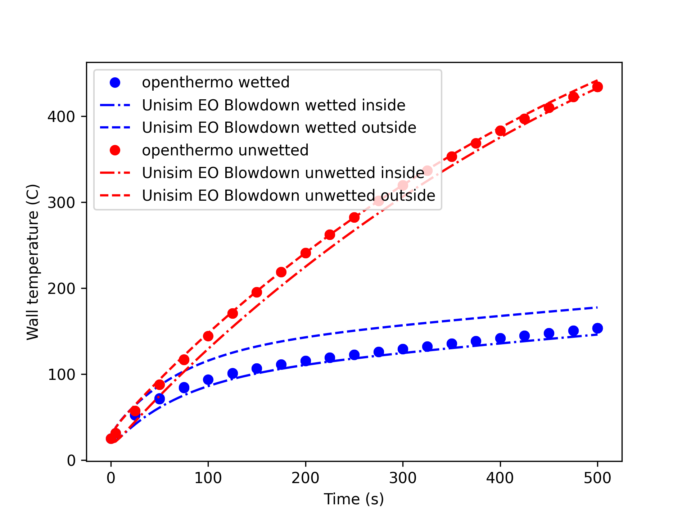

# Summary

ORS *openthermo* is a Python package for calculation of pressure vessel behaviour during depressurisation (blowdown). The software allows calculation of vessel pressure, fluid inventory temperature as well as vessel wall temperature as a function of time during depressurisation. In addition to a full phase equilibrium assumption in which liquid and gas (if two-phases are present) have the same temperature, the program also includes a partial phase equilibrium (PPE) approach which allows the gas and liquid phase to have different temperatures. The latter approach has been necessary in order to match experimental data. 

A typical system modelled using the partial equilibrium approach is shown in \autoref{fig:sketch} and it visualizes the key parameters and transport phenomena during vessel depressurisation. The thermodynamic state inside the vessel changes over time as seen from immediately observable variables temperature (T) and pressure (P). This is caused by a change in fluid inventory (density) due to flow of gas out of the vessel. Furthermore, heat is transferred from or to the surroundings via convective heat transfer on the in- and outside of the vessel - with heat being conducted through the vessel wall. 

{ width=100% }

In its essence, the code solves the mass and energy balances with gas thermodynamics calculated using a combination of [thermopack](https://github.com/thermotools/thermopack) [@thermopack] and [thermo](https://github.com/CalebBell/thermo) [@thermo] where the former are used for cubic equation of state flash calculations and the latter for thermodynamic and transport properties (enthalpy, entropy, internal energy, density, viscosity, thermal conductivity). Either the Peng-Robinson or the Soave-Redlich-Kwong cubic equation of state can be applied. The energy balance is the first law of thermodynamics for an open system exchanging both heat and mass with the surroundings [@sva]. Heat transfer between gas inventory and vessel wall is accounted for using either natural convection (wall in contact with gas) or nucleate boiling heat transfer (wall in contact with liquid) [@geankoplis]. The mass balance is closed using an applicable flow equation [@yellowbook]. The partial equilibrium approach implemented is heavily inspired by that implemented in VBsim [@speranza_blowdown_2005;@ricci_unsteady_2015;@DALESSANDRO2015719]. The model framework and validation against experiments of *openthermo* is further detailed in [@AndreasenStegelmann].

In the PPE approach, the fluid in the vessel is
divided in two different zones during the blowdown : vapour zone and liquid zone. To account for the mass and energy exchanged
between the liquid and vapour phases, it is necessary to introduce
two new child phases. The vapour child phase is formed (as bubbles) from the parent liquid vaporisation while
the liquid child phase is formed from the parent vapour condensation (as droplets). 
It is assumed that the new vapour child phase is in phase equilibrium
with the parent liquid. Likewise it is assumed that the child liquid phase is in phase
equilibrium with the parent gas phase. Consequently, it is possible to consider the
whole system as split into two partial sub-systems in non-equilibrium: parent vapour with child liquid and parent liquid with child vapour.
The whole idea of the child phases is to enable mass and energy exchange between the parent
phases and account for thermal non-equilibrium as simply as possible.

The code also allows an external heat load to be applied using the API 521 equation for pool fire heat load [@API521], Stefan-Boltzmann fire (jet and pool fire) [@scandpower;@API521] and also considers leaks (gas, liquid or two-phase). 

A few choices have been made to keep things simple:

- Only gas, liquid or two-phase gas/liquid is modelled. Three phase (Vapour-Liquid-Liquid/VLLE) is not possible.
- No temperature stratification in vessel inventory
- No temperature gradient through vessel wall (applicable for high thermal conductivity / thin-walled vessels)

Still the code can manage a number of different assumption: isothermal depressurisation (very fast), isentropic (1. law) depressurisation with and without heat transfer, rigorous partial equilibrium depressurisation. In order to model oil fractions, in addition to pure chemical components, it is also possible to include *pseudo*-components mimicking the complex hydrocarbon composition with a limited number of chemical components.  

Typical calculation output is shown in \autoref{fig:pres} and \autoref{fig:wall} with experimental data included for comparison [@Szczepanski;@WONG]. See also [@AndreasenStegelmann] for more details.

Calculations for a vessel containing a two-phase hydrocarbon subject to a large jet fire heat load as modelled by the Stefan-Boltzmann equation is shown in \autoref{fig:SB}. The calculations are compared to calculations performed using the EO Blowdown utility in the commercial tool Honeywell Unisim Design &#174;. 

# Statement of need
The rapid depressurisation (blowdown) of pressure vessels containing hazardous, either toxic or flammable,  substances in a chemical process plant, is an essential part of the plant process safety measures. 
Blowdown has both preventive and mitigating effects in case of a potential hazardous event. In case of a leak, the depressurisation significantly shortens the duration of the leak as well as rate of the leak is reduced, thus decreasing the potential fire and explosion risk.
The total amount of released inventory is reduced thereby reducing potential overpressure and impulse from explosion as well is reduced length and radiation from a jet fire. The blowdown also effectively reduces the inventory in nearby sections, thereby also reducing the risk of escalation in case of loss of containment due to exposure to fire or explosion.
During the blowdown process, the fluid temperature decreases significantly and there is a risk of the temperature of the vessel wall will become lower than the material design temperature. This may lead to brittle fracture. Being able to model the low temperature during blowdown is pivotal, especially if condensation takes place due to the high heat transfer rate between vessel wall and liquid. 

Despite the importance of being able to predict vessel response during blowdown, no free tool exists today which accomplishes the same tasks as *openthermo*. One reason is likely the complexity of the problem modelled and also the requirement of high quality thermodynamic models, especially a very robust and computationally efficient flash calculation is required. Developing such a tool requires a tremendous work effort counted in several years of full time devoted work. Existing or legacy tools are only available as a part of proprietary/commercial tools and comes at a significant license fee or via academic tools not available to the general public such as BLOWSIM [@blowsim;@mahgerefteh_numerical_1999] or VBsim [@DALESSANDRO2015719]. Even one of legacy tools (BLOWDOWN) [@haque_rapid_1990] was acquired and is now part of one of the commerical tools. For review of more codes, please refer to @SHAFIQ2020104. A few other tools are available as open source. This includes HydDown [@Andreasen2021] and HYRAM+ [@groth_hyram_2017] both relying on CoolProp [@CoolProp]. Both have limitations in handling multicomponent two-phase mixtures and the latter does not rigorously model heat transfer. None of the two employs a partial equilibrium approach.

# Acknowledgements
 The author is thankful for fruitful discussions with former colleague Jacob Gram Iskov Eriksen (Ramboll Energy, Denmark) and  colleague Carsten Stegelmann (ORS Consulting) in relation to vessel depressurisation, nozzle flow and heat transfer considerations. Carsten Stegelmann have made a huge contribution of developing VBA code for modelling the blowdown process using the equillibrium assumption and this has formed the foundation for the present Python code including the extension of the partial equilibrium approach.  

# References
